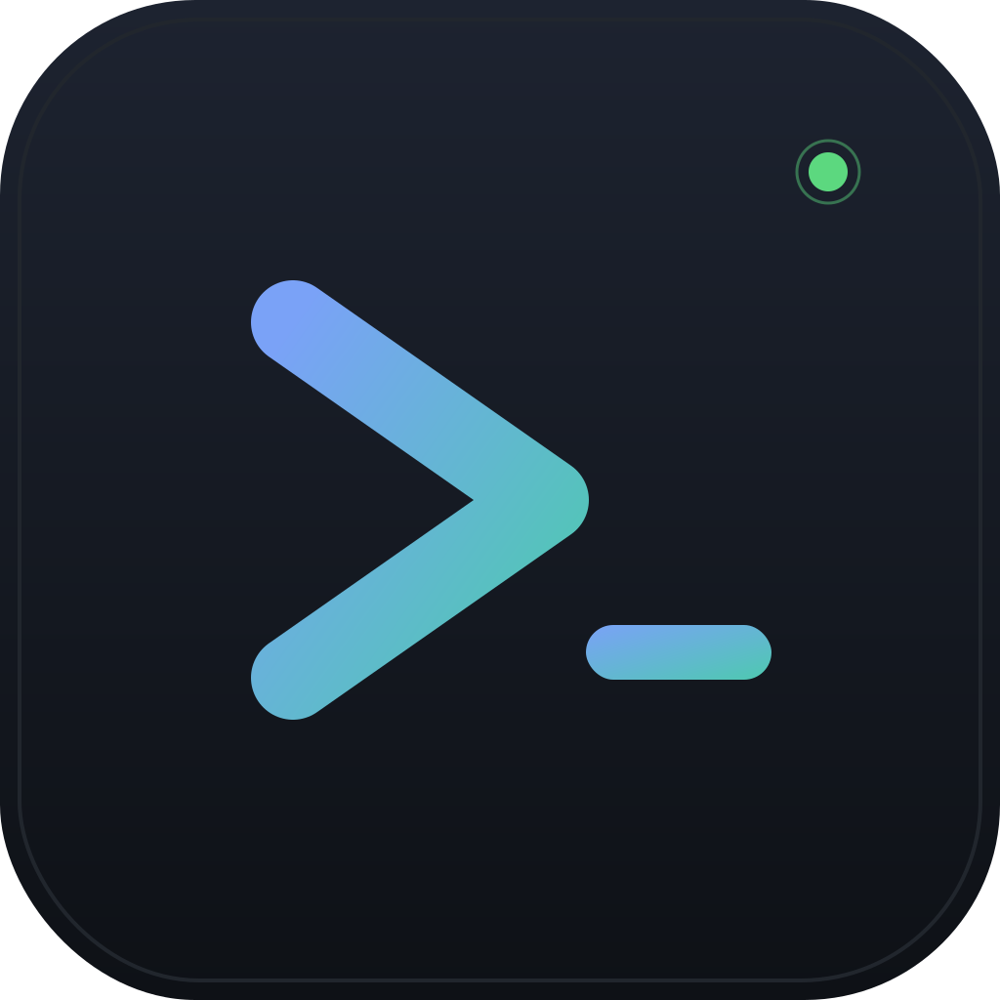

<div align="center">



# winmux

**A Windows-native terminal for AI coding agents over SSH.**

Inspired by [cmux](https://github.com/manaflow-ai/cmux). Built with Tauri 2 + Rust + SolidJS.

[](LICENSE)
[](#install)
[](https://tauri.app)
[](https://github.com/yyhezkel/winmux/releases/latest)

[**Download**](https://github.com/yyhezkel/winmux/releases/latest) ·
[Documentation](docs/) ·
[Roadmap](#roadmap) ·
[Report a bug](https://github.com/yyhezkel/winmux/issues/new)

</div>

---

## What is winmux?

winmux is a desktop terminal for developers who run AI coding agents
(Claude Code, Codex, Cursor) on remote Linux dev servers and want a
polished, opinionated Windows-native UX around them. SSH workspaces
with splits, real BiDi for Hebrew/Arabic, blocking permission cards
when an agent wants to run a tool, a bundled MCP server, and one-click
wizards for both first-time server setup and connecting to a host
you've already configured in `~/.ssh/config`.

If you live in your terminal, work primarily with remote Linux servers,
and want fine-grained control over what AI agents do on those servers —
winmux is for you.

## Features

<!-- TODO: drop a 1280×720 screenshot here once one's available. -->
<!--  -->

### 🖥️ A native Windows terminal that actually feels good

GPU-accelerated rendering via xterm.js + WebGL, or DOM-mode with
per-line `dir="auto"` for Termius-style Hebrew/Arabic handling.
Five built-in themes (Tokyo Night, Dracula, Solarized Dark/Light,
Nord), full color customization, font picker, live theme + font-size
slider — no restart.

### 🌐 SSH workspaces that don't get in your way

OpenSSH agent + Pageant + key files (encrypted ones prompt for
passphrase) + password fallback. TOFU host-key verification with clear
mismatch warnings. `tmux` persistence on connect — detach instead of
disconnect; sessions survive. Binary tree of splits per workspace.
Reverse SSH tunnel + HMAC-SHA256 lets a remote-Linux CLI call back
into the desktop securely.

### 🤖 First-class AI agent integration

One-click Claude Code launch with `--resume` / `--continue` /
`--dangerously-skip-permissions` from the Smart Connect dropdown.
Browse and resume recent Claude sessions on the remote (reads
`~/.claude/projects/`). Blocking permission hooks: the agent waits
for your Allow/Deny in the UI. Hooks are env-gated by
`WINMUX_PANE_ID`, so unrelated terminals on the same machine don't
fire them.

### 🛠️ MCP server bundled

`winmux-mcp.exe` exposes 15 browser-automation tools (click, type,
eval, find, snapshot, wait_for, etc.) over stdio JSON-RPC. Drop one
line into `~/.claude/mcp.json` and Claude Code can drive the browser
pane natively.

### 🚀 Server provisioning wizard

Give it `root` + password, get back a hardened user with sudo, an
ed25519 keypair deployed, Node/Python/Docker installed if you want
them, Claude Code installed, hooks registered. Original credentials
wrapped via Windows DPAPI per user/machine.

### 🪄 Smart connect wizard

Import hosts from `~/.ssh/config` with one click. Auto-detect keys
under `~/.ssh/` with type + fingerprint. One-click permission fix
via `icacls` when a key is "too open". "Test connection" runs the
full auth ladder and tells you exactly which stage failed and why.

### 📁 File manager pane

Dual-column local + remote SFTP — navigate, upload, download, rename,
delete, mkdir. Piggy-backs on the workspace's existing SSH session.

### ⚙️ Settings, notes, localization

Everything you'd expect: a settings panel with theme presets and a
custom color picker, a notes panel for "I had an idea, capture it",
localization for English, Hebrew, Arabic, Russian with live RTL/LTR
switch, an update checker, and a CLI (`winmux settings show/set/
preset/export/import`) for scripting it all.

## Install

Download the latest [release](https://github.com/yyhezkel/winmux/releases/latest)
and run the MSI:

```pwsh
winget download yyhezkel/winmux   # once we ship on winget
# or grab winmux_0.1.0_x64_en-US.msi from GitHub and double-click
```

Or build from source:

```pwsh
git clone https://github.com/yyhezkel/winmux
cd winmux/app
npm install
npm run tauri build              # release MSI + NSIS bundles
npm run tauri build -- --debug   # standalone debug app.exe
```

Requires Rust (stable, via [rustup](https://rustup.rs)), Node.js 18+,
and the Microsoft C++ Build Tools (`Microsoft.VisualStudio.Workload.VCTools`).
WebView2 is already present on Windows 10 21H2+ / Windows 11.

> The MSI is **not code-signed yet** — SmartScreen will warn on first
> launch. Click "More info" → "Run anyway". Code signing is on the
> v0.2 roadmap.

## Quick start

1. Launch winmux. The first run drops `%APPDATA%\winmux\settings.json`
   with sensible defaults; tweak from the gear icon (⚙) whenever.
2. Click **+ New workspace** → pick **SSH** → either fill the fields
   or hit **Import from SSH config** to pull a host from `~/.ssh/config`.
   The wizard auto-detects keys under `~/.ssh/`, flags too-open
   permissions, and offers an in-place "Test connection".
3. **Connect**. winmux SFTP-uploads its remote CLI on first connection
   and exposes a reverse tunnel back to the desktop. From the Connect
   dropdown you can spawn `claude`, `claude --resume` from the session
   browser, a plain shell, or any custom command.

When an agent triggers a permission hook, a card appears top-right
with Allow / Deny. The agent blocks until you decide.

## Compared to alternatives

This is a small space; the choices here are real tradeoffs, not
"winmux beats everything". Be honest with yourself about what you
need.

| | **winmux** | [cmux](https://github.com/manaflow-ai/cmux) | [Warp](https://www.warp.dev) | [Termius](https://termius.com) |
|---|---|---|---|---|
| Primary platform        | Windows                | macOS                  | macOS / Linux / Windows | Windows / macOS / Linux / iOS / Android |
| License                 | GPL-3.0-or-later       | AGPL-3.0               | AGPL-3.0 (app)         | Proprietary (free tier with limits)     |
| SSH workspaces          | ✓                      | ✓                      | ✓                      | ✓                                       |
| Splits / tabs           | ✓ (binary tree)        | ✓                      | ✓                      | ✓                                       |
| Blocking agent hooks    | ✓                      | ✓                      | partial (built-in only)| ✗                                       |
| Bundled MCP server      | ✓ (15 tools)           | ✗                      | ✗                      | ✗                                       |
| Claude Code launcher    | ✓ with session browser | ✓                      | ✗                      | ✗                                       |
| File manager (SFTP)     | ✓                      | ✗                      | ✗                      | ✓                                       |
| Server provisioning     | ✓ wizard               | ✗                      | ✗                      | ✓ snippets                              |
| RTL (Hebrew / Arabic)   | ✓ per-line auto + BiDi | ✗                      | partial                | partial                                 |
| Free for personal use   | ✓                      | ✓                      | ✓                      | partial                                 |

If you're on macOS, look at **cmux** first — it's the project that
inspired winmux and is more mature there. If you want a polished
cross-platform terminal with built-in AI features and don't need
remote-server provisioning, **Warp** is excellent. If you want a
mature commercial SSH client across every device including mobile,
**Termius** is the standard. winmux is the one to pick when you're on
Windows, work primarily with remote Linux dev servers, run AI agents
on those servers, and want them gated behind a UI you control.

## Architecture

```
┌─────────────────────────────────┐         ┌──────────────────────────────┐
│  Windows desktop                 │         │  Remote Linux server         │
│                                  │         │                              │
│  ┌────────────┐  ┌────────────┐  │         │  ┌────────────────────────┐  │
│  │  app.exe   │  │winmux.exe  │  │         │  │  winmux (CLI, musl)    │  │
│  │  (Tauri)   │  │  (CLI)     │  │         │  │  bootstrapped via SFTP │  │
│  └─────┬──────┘  └─────┬──────┘  │         │  └────────┬───────────────┘  │
│        │ Named Pipe    │ Named Pipe         │           │                  │
│        │ JSON-RPC v2   │ JSON-RPC v2        │           │ HMAC-SHA256      │
│        ▼               ▼                    │           │ reverse tunnel   │
│  ┌────────────────────────────┐  ◄──────────┼───────────┘ JSON-RPC v2      │
│  │   in-process RPC server    │  reverse SSH│                              │
│  └────────────────────────────┘             │  ┌────────────────────────┐  │
│  ┌────────────┐                              │  │ Claude Code            │  │
│  │winmux-mcp  │  ──── MCP (stdio) ───►       │  │ + ~/.claude/hooks      │  │
│  │  .exe      │                              │  │   → winmux claude-hook │  │
│  └────────────┘                              │  └────────────────────────┘  │
└─────────────────────────────────┘            └──────────────────────────────┘
```

See [docs/ARCHITECTURE.md](docs/ARCHITECTURE.md) for the full
narrative version with ASCII state diagrams and module ownership.

## Roadmap

Shipped in **v0.1.0** (Phases 1 through 15.B):

local PTY · BiDi (UAX #9) · SSH via russh · multi-workspace +
persistence + splits · CLI + JSON-RPC over Named Pipe + reverse
SSH tunnel · MSI + NSIS · remote-Linux CLI bootstrap · HMAC-SHA256
auth · agent feed + permission cards · notes · browser panes ·
winmux-mcp MCP server · settings panel + 5 themes + live apply ·
update checker · tmux persistence · localization (en / he / ar / ru) ·
smart-connect (Claude session browser, ssh_config import, key
auto-detect, perms fix, connection test) · server provisioning
wizard · file manager pane (dual local + SFTP).

Coming next:

- 🔮 PATH auto-registration in the WiX installer
- 🔮 Code-signing for the MSI / NSIS
- 🔮 Auto-update via signed manifest + delta downloads
- 🔮 ARM64 Windows build
- 🔮 aarch64-linux CLI
- 🔮 winget / Scoop manifests

## Documentation

- [Architecture](docs/ARCHITECTURE.md) — high-level overview + ASCII diagram
- [Modules](docs/MODULES.md) — what each Rust module + frontend file owns
- [Protocols](docs/PROTOCOLS.md) — JSON-RPC catalog, framing, HMAC handshake, agent-hook contract
- [Config](docs/CONFIG.md) — `workspaces.json` / `settings.json` / `known_hosts.json` schemas; env vars
- [CLI reference](docs/CLI.md) — every `winmux` subcommand with examples and exit codes
- [Build](docs/BUILD.md) — prerequisites, dev / debug builds, Linux cross-compile, common gotchas
- [Contributing](docs/CONTRIBUTING.md) — adding RPC methods, agent hooks, pane types; logging + commit conventions
- [Security](SECURITY.md) — vulnerability disclosure policy

## Acknowledgments

winmux stands on the shoulders of giants:

- **[cmux](https://github.com/manaflow-ai/cmux)** — the macOS reference design that inspired the workspace + permission-card UX
- **[Tauri](https://tauri.app)** — the framework that makes a 7 MB Rust + WebView desktop app possible
- **[xterm.js](https://xtermjs.org)** — the terminal frontend; with the WebGL addon for fast paint
- **[russh](https://crates.io/crates/russh)** + **[russh-keys](https://crates.io/crates/russh-keys)** + **[russh-sftp](https://crates.io/crates/russh-sftp)** — pure-Rust SSH client + sftp
- **[bidi-js](https://github.com/lojjic/bidi-js)** — UAX #9 BiDi reorder for Hebrew/Arabic
- **[portable-pty](https://crates.io/crates/portable-pty)** — ConPTY/POSIX PTY abstraction
- **[SolidJS](https://www.solidjs.com)** — the frontend reactive runtime
- **[tokio](https://tokio.rs)** — async runtime
- And countless dependencies pinned in `Cargo.toml` / `package.json`

Thank you also to the **Claude Code** team at Anthropic for the
public hooks + MCP specs that make first-class agent integration
feasible.

## Security

Found a vulnerability? See [SECURITY.md](SECURITY.md) — please email
the maintainer privately rather than opening a public issue.

## License

[GPL-3.0-or-later](LICENSE). Copyright © 2026 Yossi Yehezkel.
