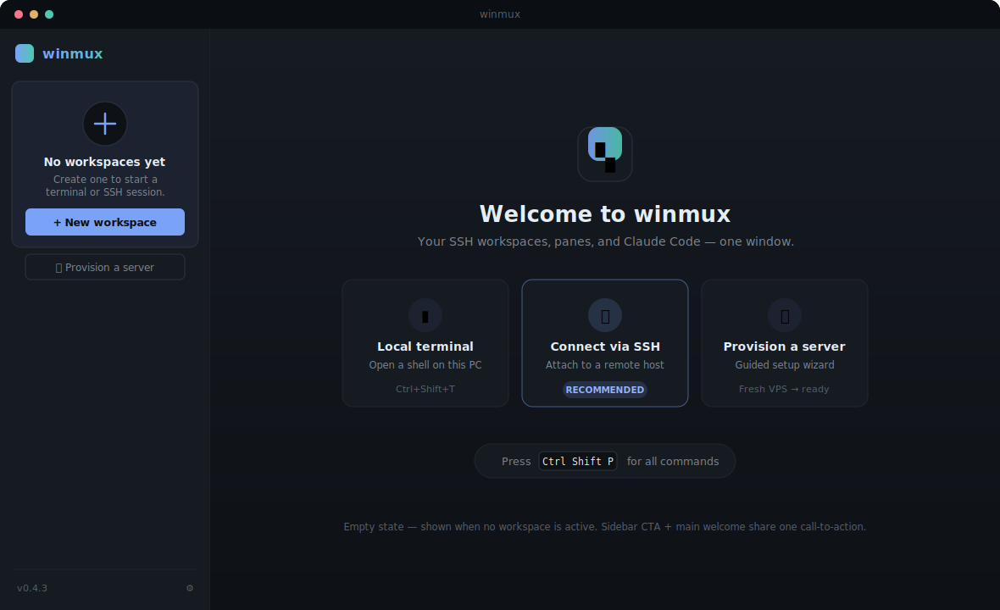
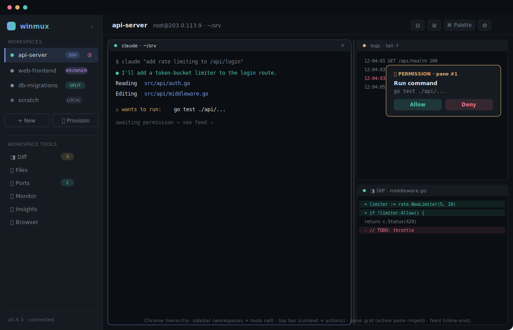
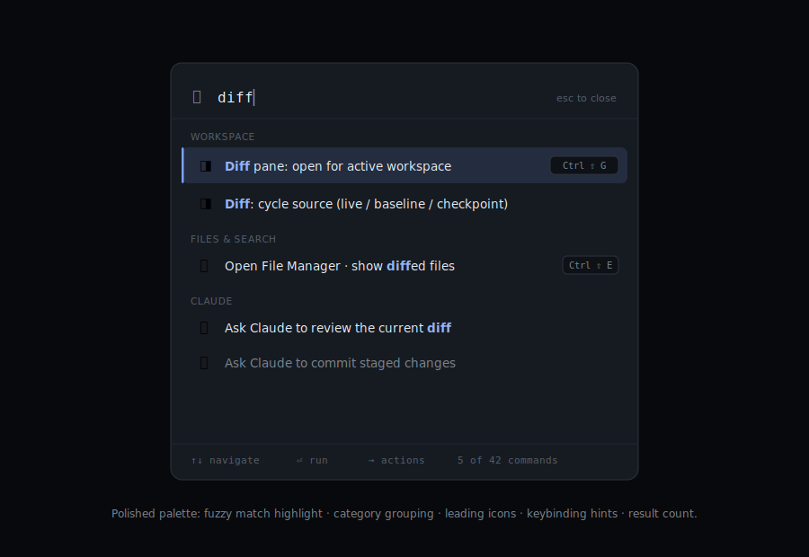
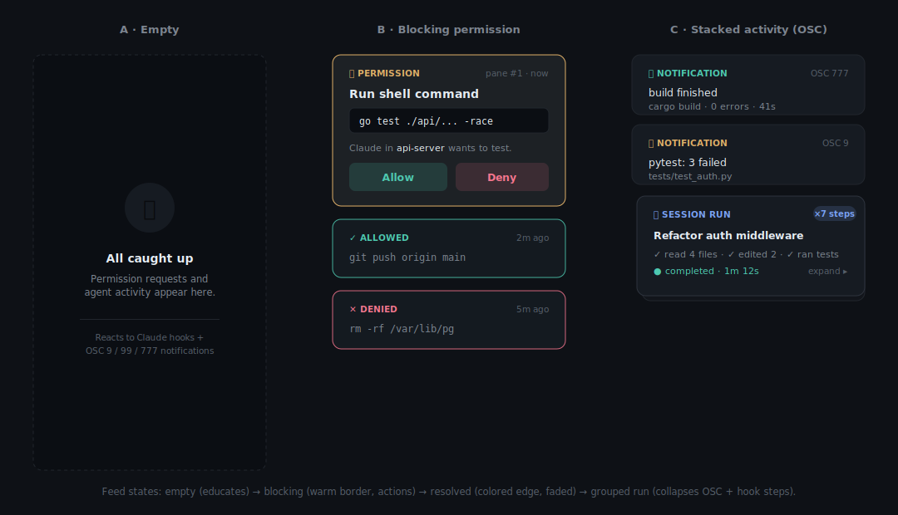
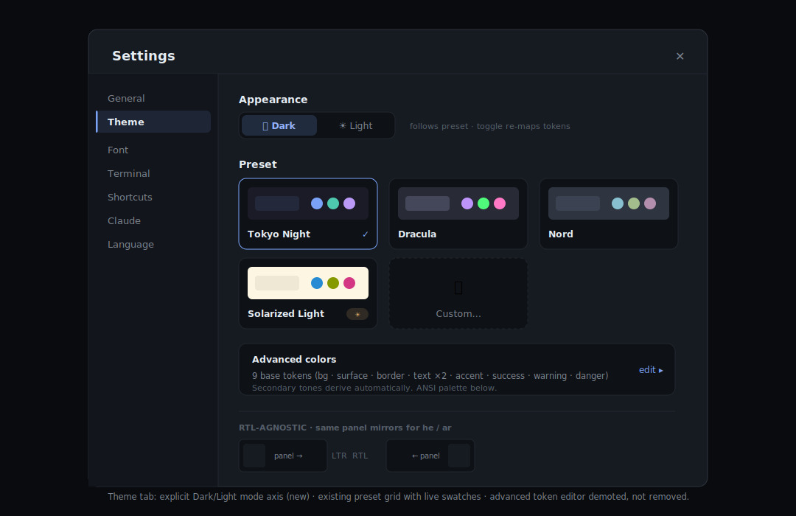

# DESIGN-PASS-01 — winmux Visual & Interaction Design Brief

> **Status:** proposal · design + spec only, **no code changed**
> **Author:** design pass, 2026-07-02
> **Scope:** token system, five hero surfaces, motion & RTL rules, phased rollout
> **Companion files:** `docs/design/01..05-*.svg` (mockups)

This is a **design-first** document, not a feature list. Every decision below traces
to one of the [design principles](#2-design-principles). It builds *on* what already
ships in `app/src/` — it does not restart the styling.

---

## 0. Method

Audited the live styling in `app/src/App.css` (128 KB, ~4000 rules), `settings.ts`
(`applyTheme`), the `Theme` binding, and the components for each surface. Cross-read
`docs/COMPETITIVE-SCAN.md` for positioning. No screenshots were needed — the CSS *is*
the source of truth and was read directly.

**What already exists (and we keep):**
- A CSS-variable token layer (`--w-*`) written live by `applyTheme()` into `<html>`.
- A **preset system** — `tokyo-night` (default), `dracula`, `nord`, `solarized-dark`,
  `solarized-light` — with a swatch grid in Settings → Theme (`settings_get_presets` /
  `settings_apply_preset`). *The "raw color inputs only" pain point is partly stale:
  presets ship. What's missing is a **mode axis** and a **deeper token layer**.*
- `mix()`-derived secondary tones, so users set 9 colors, not 20.
- Real RTL intent: 28 `inline-start/end` uses, `bidi.ts`, per-line UAX#9 handling.

**The real gaps (what this pass fixes):**

| Gap | Evidence | Fix |
|---|---|---|
| Token layer too shallow | 25 vars; **no** spacing / elevation / motion / focus scale | §3 full `--wmx-*` system |
| No Dark/Light **mode** | presets mix dark+light with no toggle; `prefers-color-scheme` unused | §3.1 mode axis + §mockup 05 |
| Ad-hoc spacing | padding values 1,2,3,4,5,6,7,8,10,12px — no rhythm | §3.3 4/8/12/16/24/32 scale |
| Unstepped radius | 3,4,5,6,8,10,999 all in use | §3.4 sm/md/lg/xl/pill |
| Empty state is 2 lines | `App.tsx:2032` — `<p>` + one button | §mockup 01 welcome |
| Palette is bare | `CommandPalette.tsx` — substring match, no icons/highlight/hints | §mockup 03 |
| RTL leaks | 46 `left/right` vs 28 `inline-*`; `.feed-panel{right:12px}` (`App.css:1336`) | §3.7 RTL rules |
| ~40 raw hex bypass tokens | e.g. `#1f2530`, `#2a2e44`, `rgba(122,162,247,.12)` ×N | §5 token rollout |

---

## 1. Product identity (the anchor)

winmux is a **Windows-native Tauri + SolidJS terminal multiplexer** whose one-line
identity is:

> **The workspace where your SSH servers, your panes, and Claude Code live in one
> window — and it speaks your language, right-to-left included.**

Three things nobody else in the [8-project `winmux` field](COMPETITIVE-SCAN.md) combines:
Windows + SSH workspaces + AI-agent integration. Warp is polished but mac-first and
RTL-hostile; cmux/superset are local-only. **RTL as a first-class citizen (he/ar/ru)
is heritage we protect, not a toggle we tolerate.** The design must never regress it.

The app is not a terminal with extras — it's an **IDE-like workspace**: Diff,
FileManager, Ports, Monitor, Insights, Browser all hang off each workspace. The chrome
must express that hierarchy without drowning the terminal, which stays the star.

---

## 2. Design principles

Four principles. Every token, spacing choice, and motion curve below serves one.

### P1 — A terminal that respects your language
RTL is structural, not cosmetic. **No physical `left`/`right` in layout** — only
`inline-start`/`inline-end`, `margin-inline`, `inset-inline`. The sidebar, feed,
palette, and every panel mirror losslessly for he/ar. Latin identifiers and code stay
LTR inside RTL chrome (already handled by `bidi.ts`). *Test: flip `dir="rtl"` and every
affordance lands on the mirrored edge.*

### P2 — Workspace, not window
The unit is the **workspace** (a host + its panes + its tools), not a lone terminal
tab. Chrome makes the active workspace obvious (ring, rail), and its tools (Diff/Files/
Ports/Monitor/Insights/Browser) are one glance away with live-count badges — the
"IDE-like" promise, visible.

### P3 — Calm by default, loud when it matters
The resting UI is quiet: one accent, muted text, flush surfaces. Attention is *spent*,
not sprayed — a blocking permission request gets a warm border and motion; a finished
build gets a soft card. Color = meaning (accent/success/warning/danger), never decoration.

### P4 — Discoverable depth
20+ actions, ~5 shortcuts. The Command Palette is the **map** of the app — fuzzy,
categorized, icon-led, with keybinding hints that *teach* shortcuts. Empty states
educate instead of dead-ending. You can always find the next step without documentation.

---

## 3. Design tokens — `--wmx-*`

**Naming:** migrate `--w-*` → `--wmx-*` (namespaced, collision-safe, matches the brand).
During transition, keep `--w-*` as **aliases** pointing at the new vars so no rule breaks
mid-migration (see §5). Tokens are **semantic** (role-named), not literal — `--wmx-danger`,
not `--wmx-red`.

### 3.1 Color — two-layer, mode-aware

Layer 1 is a small primitive ramp; Layer 2 are semantic roles that flip by **mode**
(`data-mode="dark"|"light"` on `<html>`, defaulting from `prefers-color-scheme`). Presets
set the *accent + ansi personality*; mode sets the *surface polarity*. A preset can ship
both a dark and light variant (Solarized already does).

```css
:root, [data-mode="dark"] {
  /* surfaces: recede → raise */
  --wmx-bg:            #0e1116;   /* app background            (was --w-bg)        */
  --wmx-surface:       #161b22;   /* sidebar, cards, top bar   (was --w-surface)   */
  --wmx-surface-raised:#1c2230;   /* popovers, hovered rows    (was --w-surface-hi)*/
  --wmx-border:        #21262d;   /* hairlines                 (was --w-border)    */
  --wmx-border-strong: #2d333d;   /* card edges, inputs        (was --w-border-hi) */
  /* text */
  --wmx-text:          #e6edf3;   /* primary                   (was --w-text)      */
  --wmx-text-muted:    #7d8590;   /* secondary/labels          (was --w-text-dim)  */
  --wmx-text-faint:    #565f6a;   /* hints, disabled           (was --w-text-faint)*/
  /* meaning */
  --wmx-accent:        #7aa2f7;   --wmx-accent-strong: #94b4ff;
  --wmx-success:       #4ec9b0;   --wmx-warning:       #e0af68;
  --wmx-danger:        #f7768e;   --wmx-info:          #bb9af7;
  /* tint fills (replace the ~40 rgba(...) literals) */
  --wmx-accent-fill:   color-mix(in srgb, var(--wmx-accent) 14%, transparent);
  --wmx-success-fill:  color-mix(in srgb, var(--wmx-success) 16%, transparent);
  --wmx-danger-fill:   color-mix(in srgb, var(--wmx-danger) 14%, transparent);
  --wmx-warning-fill:  color-mix(in srgb, var(--wmx-warning) 16%, transparent);
}

[data-mode="light"] {
  --wmx-bg:            #f6f8fa;  --wmx-surface:       #ffffff;
  --wmx-surface-raised:#f0f3f6;  --wmx-border:        #d0d7de;
  --wmx-border-strong: #b9c1ca;
  --wmx-text:          #1f2328;  --wmx-text-muted:    #59636e;  --wmx-text-faint: #818b96;
  /* accents darkened for AA contrast on white */
  --wmx-accent:        #3b62d9;  --wmx-accent-strong: #2a4fc4;
  --wmx-success:       #1a7f64;  --wmx-warning:       #9a6700;
  --wmx-danger:        #cf222e;  --wmx-info:          #8250df;
}
```

> **Note on `applyTheme`:** it already derives `surface-hi`, `border-hi`, `text-faint`,
> `accent-hi` via `mix()`. That logic ports 1:1 — it just writes `--wmx-*` names and
> gains a `data-mode` write. The 9-color user contract is unchanged.

### 3.2 Typography

Root font-size stays driven by `--wmx-font-size-ui` (user slider), sizes in `em` so the
slider rescales everything — **keep that mechanism**. Formalize the scale + weights +
line-heights that today are inline literals.

```css
--wmx-font-ui:   -apple-system,"Segoe UI Variable","Segoe UI",system-ui,sans-serif;
--wmx-font-mono: "Cascadia Mono","JetBrains Mono","SF Mono",Consolas,ui-monospace,monospace;
--wmx-font-size-ui: 13pt;                  /* user-controlled root */

--wmx-fs-xs: 0.75em;  --wmx-fs-sm: 0.8125em; --wmx-fs-md: 0.875em;  /* body */
--wmx-fs-lg: 1em;     --wmx-fs-xl: 1.125em;  --wmx-fs-2xl: 1.375em; /* titles */

--wmx-fw-regular: 400; --wmx-fw-medium: 500; --wmx-fw-semibold: 600; --wmx-fw-bold: 700;
--wmx-lh-tight: 1.25;  --wmx-lh-normal: 1.5;  --wmx-lh-relaxed: 1.7;
```
Usage: labels/badges `xs`, body `md`, section titles `lg semibold`, modal/welcome
headings `xl–2xl bold`. Mono only for code, paths, keybindings, terminal.

### 3.3 Spacing — 4-based rhythm

Replace scattered 1–12px paddings with a 6-step scale (plus a hairline half-step).
Everything snaps to it.

```css
--wmx-space-0: 0;    --wmx-space-px: 1px;
--wmx-space-1: 4px;  --wmx-space-2: 8px;  --wmx-space-3: 12px;
--wmx-space-4: 16px; --wmx-space-5: 24px; --wmx-space-6: 32px;
```
Rows/items: `space-1`–`space-2`. Card padding: `space-3`. Section gaps: `space-4`.
Modal insets / welcome blocks: `space-5`–`space-6`.

### 3.4 Radius

```css
--wmx-radius-sm: 4px;   /* inputs, badges, small buttons */
--wmx-radius-md: 6px;   /* rows, cards, tabs             */
--wmx-radius-lg: 10px;  /* modals, popovers, palette     */
--wmx-radius-xl: 14px;  /* welcome cards, hero surfaces  */
--wmx-radius-pill: 999px;
```
Retire ad-hoc `3px`/`5px`/`8px` → nearest step (sm/md/lg).

### 3.5 Elevation — 4 levels

Shadows encode "how far off the page." One token per level; no bespoke shadows.

```css
--wmx-elev-0: none;                                              /* flush           */
--wmx-elev-1: 0 1px 2px rgba(0,0,0,.30);                        /* raised row/chip */
--wmx-elev-2: 0 8px 28px rgba(0,0,0,.55);                       /* card / feed     */
--wmx-elev-3: 0 16px 48px rgba(0,0,0,.55);                      /* modal / palette */
```
(Light mode softens to `.10/.18/.22` opacities via the same tokens under
`[data-mode="light"]`.) The feed's existing `0 8px 28px` = `elev-2`; palette's
`0 16px 48px` = `elev-3` — already consistent, just tokenize.

### 3.6 Motion

Today motion is mostly `100ms` with strays (`80/90/180/220/240/480ms`). Standardize.

```css
--wmx-dur-instant: 80ms;   /* hover tints, focus         */
--wmx-dur-fast:    120ms;  /* row/tab state              */
--wmx-dur-base:    180ms;  /* card in, popover, palette  */
--wmx-dur-slow:    240ms;  /* panel/layout, empty→filled */
--wmx-ease-standard:   cubic-bezier(.2,.8,.2,1);  /* enter/most (feed already uses) */
--wmx-ease-decelerate: cubic-bezier(0,0,.2,1);    /* elements entering              */
--wmx-ease-accelerate: cubic-bezier(.4,0,1,1);    /* elements leaving               */
```
**Respect `prefers-reduced-motion`:** collapse transforms to opacity-only, durations→`0`.

### 3.7 Focus & accessibility

A single visible focus ring, high-contrast, offset so it reads on any surface. Applies
to every interactive element via `:focus-visible` (keyboard only — no mouse-click halos).

```css
--wmx-ring-width: 2px;
--wmx-ring: 0 0 0 2px var(--wmx-bg), 0 0 0 4px var(--wmx-accent);
:where(button,a,input,select,[tabindex]):focus-visible {
  outline: none; box-shadow: var(--wmx-ring); border-radius: var(--wmx-radius-sm);
}
```
Contrast targets: body text ≥ 4.5:1, large/badge ≥ 3:1 — the light-mode accents above
are chosen to clear AA on `--wmx-surface`.

### 3.8 RTL rules (P1, enforced)

1. **No physical properties** in layout: use `padding-inline`, `margin-inline`,
   `inset-inline-start/end`, `border-inline-start`. Physical `left/right` allowed *only*
   for centering transforms (`left:50%;translateX(-50%)`).
2. **Fix the known leak:** `.feed-panel { right: 12px }` → `inset-inline-end: 12px`
   (`App.css:1336`). Audit the other 45 physical uses the same way.
3. Icons that imply direction (chevrons, "next") flip with `[dir="rtl"] { transform: scaleX(-1) }`.
4. Directional shadows/gradients are direction-neutral or mirrored.

---

## 4. Mockups

Five hero surfaces. Each renders from `docs/design/*.svg` and lists its rationale +
principles served. Colors are the real Tokyo-Night dark values.

### 4.1 Empty state / welcome — `01-empty-state.svg`  **(highest onboarding value)**



Today `App.tsx:2032` renders a bare `<p>` + button when no workspace is active. The
mockup replaces it with a two-part welcome that shares **one** call-to-action:
- **Sidebar CTA card** — "No workspaces yet", a big `+ New workspace`, and a secondary
  `🚀 Provision a server`. The sidebar is never empty/confusing.
- **Main welcome** — brand glyph, one-line value prop, and **three quick-start cards**
  (Local terminal · **Connect via SSH** *(recommended)* · Provision a server), plus a
  `Ctrl Shift P` palette hint that teaches the map from second one.

*Serves P2 (workspace-first), P4 (educates, teaches the palette), P3 (calm, single accent).*

### 4.2 Workspace chrome — `02-workspace-chrome.svg`



The full IDE-like frame with clear hierarchy:
- **Sidebar** = two zones: *Workspaces* (kind badge SSH/BROWSER/SPLIT/LOCAL, live dot,
  pending-count) and a **Workspace Tools rail** (Diff/Files/Ports/Monitor/Insights/
  Browser) with live-count badges — the "IDE" promise made visible.
- **Top bar** = active context (name + `user@host · cwd`) on the inline-start, actions
  (split, palette, settings) on the inline-end.
- **Pane grid** = active pane wears the accent ring; splits share one divider token;
  panes host terminal / logs / **Diff** interchangeably.
- **Feed** floats at `inset-inline-end` with a blocking permission card.

*Serves P2, P3 (only the blocking card is loud), P1 (mirrors wholesale).*

### 4.3 Command Palette — `03-command-palette.svg`



Upgrades `CommandPalette.tsx` from substring→polished:
- **Fuzzy match with highlight** — matched chars in `--wmx-accent-strong` bold.
- **Category grouping** (Workspace / Files / Claude / …) with muted section labels.
- **Leading icons** per command, **keybinding hints** right-aligned (teaches shortcuts).
- **Footer bar**: `↑↓ navigate · ⏎ run · → actions · N of M`.

*Serves P4 (the map), P3 (one selected accent), P1 (`→ actions` uses inline logical keys).*

### 4.4 Feed / activity cards — `04-feed-cards.svg`



Three states end-to-end:
- **Empty** — dashed card, "All caught up", explains it reacts to Claude hooks **and**
  OSC 9/99/777 (ties to COMPETITIVE-SCAN #1.2).
- **Blocking** — warm `--wmx-warning` border + `--wmx-warning-fill`, command in a mono
  chip, `Allow`/`Deny`. Resolved cards keep a colored edge and fade (existing
  `feed-state-*` classes, tokenized).
- **Grouped run** — stacked card that collapses a multi-step agent run (OSC + hook
  steps) with an `×7 steps` badge and expand affordance.

*Serves P3 (spend attention only on blocking), P4 (empty educates).*

### 4.5 Settings — theme — `05-settings-theme.svg`



- **Appearance mode toggle (new)** — segmented `🌙 Dark / ☀ Light`, visible, writes
  `data-mode` and re-maps tokens instantly.
- **Preset grid** — the existing swatch cards (`settings-preset-grid`), now showing a
  live mini-terminal + accent trio; light presets get a `☀` chip.
- **Advanced colors demoted, not removed** — the 9 raw inputs collapse behind an
  `edit ▸` on a summary card. Power users keep full control; newcomers see presets first.
- **RTL mirror strip** proves the panel flips.

*Serves P4 (presets first), P1 (mirror shown), P3 (calm default).*

---

## 5. Implementation deltas

Grouped **Quick wins** (ship independently, 1–2 h each, no token migration required) vs
**System refactor** (the `--wmx-*` rollout). No code is written in this pass — this is the
build menu Yossi picks from.

### Quick wins (each standalone, low risk)

| # | Change | Files | Est |
|---|---|---|---|
| Q1 | **Welcome empty-state** — replace `.empty` block with sidebar CTA card + main welcome + 3 quick-start cards + palette hint | `App.tsx:2031`, `App.css` (`.empty`, new `.welcome-*`), `i18n/*.json` (`ws.empty.*`, new keys) | 2 h |
| Q2 | **Fix the RTL feed leak** | `App.css:1336` `right`→`inset-inline-end` | 5 m |
| Q3 | **Palette highlight + hints + icons** — add fuzzy highlight, `Command.icon?`, `Command.hint?`, `Command.category?`; render groups + footer | `CommandPalette.tsx`, `App.css:3790` (`.command-palette-*`), command list in `App.tsx` | 2–3 h |
| Q4 | **Dark/Light mode toggle** — segmented control writes `data-mode`; `applyTheme` sets it; light overrides block in CSS | `SettingsModal.tsx` (theme tab ~L275), `settings.ts` `applyTheme`, `settings.rs` (`Theme.mode`), `App.css` `[data-mode=light]` | 2 h |
| Q5 | **Feed empty state** — render the "All caught up" card when the feed is empty | `FeedPanel.tsx`, `App.css:1333` | 1 h |
| Q6 | **Focus-ring token** — add `--wmx-ring` + one `:focus-visible` rule; remove scattered `outline` overrides | `App.css` (top + audit 41 focus rules) | 1–2 h |

### System refactor (the token rollout — do once, unlocks the rest)

| # | Change | Files | Est |
|---|---|---|---|
| R1 | **Introduce `--wmx-*` tokens** in `:root` (color/type/space/radius/elev/motion/focus) and alias `--w-* → --wmx-*` so nothing breaks | `App.css` `:root` (L8–46) | 2 h |
| R2 | **Port `applyTheme`** to write `--wmx-*` + `data-mode`; keep `mix()` derivations | `settings.ts:307` | 1 h |
| R3 | **Replace ~40 raw hex / rgba literals** with tokens (`#1f2530`, `#2a2e44`, `rgba(122,162,247,.12)`, …) | `App.css` (sweep) | 3–4 h |
| R4 | **Snap spacing/radius** to the scales (find/replace with review) | `App.css` (sweep) | 3–4 h |
| R5 | **RTL audit** — convert the 45 remaining physical `left/right` to logical | `App.css` (sweep) | 2–3 h |
| R6 | **Motion tokens** — replace literal `ms`/easings with `--wmx-dur-*`/`--wmx-ease-*`; add `prefers-reduced-motion` block | `App.css` (sweep) | 1–2 h |

**Suggested order:** R1→R2 (foundation, invisible) → Q1/Q3/Q4 (visible wins on the new
base) → R3–R6 (progressive cleanup, each independently shippable) → Q2/Q5/Q6 (polish).

---

## 6. Motion & interaction spec

| Interaction | Behavior | Tokens |
|---|---|---|
| **Empty → filled** | On first workspace create, welcome fades/scales out (`accelerate`) as the pane grid fades in (`decelerate`) — no hard cut | `--wmx-dur-slow`, both eases |
| **Split creation** | New pane wipes in from the divider edge (inline-start→end), divider draws first | `--wmx-dur-base`, `--wmx-ease-standard` |
| **Focus adjacency** (`Ctrl+Alt+Arrow`, COMPETITIVE-SCAN #1.4) | Focus ring slides to the neighbor pane with a 120ms translate; if no pane there, a subtle edge pulse hints "would split" | `--wmx-dur-fast` |
| **Palette open** | Backdrop fades (`instant`), panel drops 8px + fades (`base`, `decelerate`); close reverses (`accelerate`) | `--wmx-dur-base`, `--wmx-elev-3` |
| **Feed card in** | Slides from `inline-end` +8px + fades (already `feed-in` 180ms) → tokenize | `--wmx-dur-base`, `--wmx-ease-standard` |
| **Blocking card** | On arrival, one 2-cycle warm-border breathe to pull the eye, then rests | `--wmx-warning`, `--wmx-dur-slow` |
| **Hover/press** | Tint on `instant`; buttons `active { transform: scale(.98) }` (already used) | `--wmx-dur-instant` |

All the above collapse to opacity-only / instant under `prefers-reduced-motion: reduce`.

---

## 7. Open questions (for Yossi)

1. **`--w-*` → `--wmx-*` rename** — do it (with aliases) now, or keep `--w-*` and just
   *extend*? Rename is cleaner long-term; aliases make it zero-risk. *Recommend: rename+alias.*
2. **Light mode default** — follow `prefers-color-scheme`, or force dark until the user
   opts in? *Recommend: follow OS, remember the user's explicit choice.*
3. **Rebrand** (COMPETITIVE-SCAN warns the `winmux` name is crowded) — out of scope here,
   but the welcome glyph/wordmark is where a rename would land first. Flagging, not deciding.

---

## 8. Summary

winmux already has good bones — a live-token theming engine, a preset system, real RTL
plumbing. This pass **deepens** them: a full `--wmx-*` token layer (color with a Dark/Light
mode axis, plus spacing/radius/elevation/motion/focus scales), and five redesigned
surfaces led by the empty-state/welcome (the biggest onboarding gap today). The work
splits cleanly into **quick wins** that ship on the current CSS and a **token rollout**
that's invisible until you build on it — so nothing has to land all at once, and RTL is
protected at every step.
